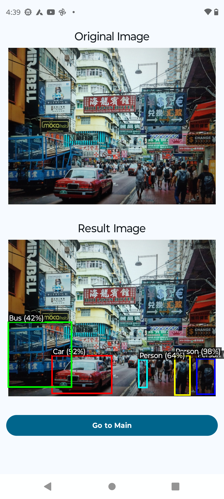

# Object Detector

A streamlined Android application designed to perform object detection on user captured images, providing visual feedback with identified labels and confidence metrics.

## 🚀 Features
- **On-Device Object Detection:** Utilizes ML kit to process images locally.
- **Visual Result Overlay:** Renders the original image alongside a processed version featuring colored bounding boxes, descriptive labels, and confidence scores.

## 🛠 Tech Stack
- **Language:** [Kotlin](https://kotlinlang.org/)
- **UI Framework:** [Jetpack Compose](https://developer.android.com/jetpack/compose) with Material Design 3
- **Architecture:** MVVM (Model-View-ViewModel)
- **Navigation:** [Jetpack Navigation 3](https://developer.android.com/jetpack/androidx/releases/navigation)
- **Image processor** [ML Kit](https://developers.google.com/ml-kit/vision/object-detection/android)
- **Image Loading:** [Coil](https://coil-kt.github.io/coil/)
- **Concurrency:** Kotlin Coroutines & Flow

## 📖 How to Use
1. **Launch the App:** You will be greeted with the Home Screen featuring a "Capture image" button.
2. **Launch camera:** Tap the button to launch camera to capture image.
3. **Processing:** The app will automatically start the on-device object detection process.
4. **View Results:** Detected objects are highlighted with bounding boxes and labeled with their text and confidence score.

## Result

### References
- [ML kit Android](https://developers.google.com/ml-kit/vision/object-detection/android)
- [ML Kit Vision Quickstart Sample App](https://github.com/googlesamples/mlkit/tree/master/android/vision-quickstart)
- [ML Kit Vision Showcase App](https://github.com/googlesamples/mlkit/tree/master/android/material-showcase)
